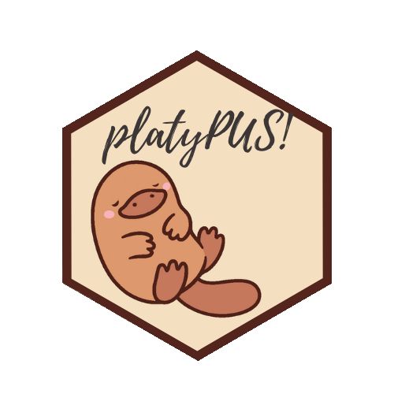

---
output:
 md_document:
  variant: markdown_github
params:
  repo_name: platypus
  repo_url: https://github.com/maju116/platypus
  chagelog_url: https://github.com/maju116/platypus/blob/master/CHANGELOG.md
  code_of_coduct: https://github.com/maju116/platypus/blob/develop/CODE_OF_CONDUCT.md
---

```{r, echo = FALSE}
knitr::opts_chunk$set(
  collapse = TRUE,
  comment = "#>",
  fig.path = "man/figures/README-"
)
```



#  `r params$repo_name`

**R package for object detection and image segmentation**

With `platypus` it is easy create advanced computer vision models like YOLOv3 and U-Net in a few lines of code.

How to install?
---------------

You can install the latest version of `platypus` with `remotes`:

```{r, eval=FALSE}
remotes::install_github("maju116/platypus")
```

(`master` branch contains the stable version. Use `develop` branch for latest features)

To install [previous versions](`r params$changelog_url`) you can run:

```{r, eval=FALSE}
remotes::install_github("maju116/platypus", ref = "0.1.0")
```

In order to install `platypus` you need to install `keras` and `tensorflow` packages and `Tensorflow` version `>= 2.0.0` (`Tensorflow 1.x` will not be supported!)

YOLOv3 bounding box prediction with pre-trained COCO weights:
---------------

To create `YOLOv3` architecture use:

```{r, message = FALSE}
library(tidyverse)
library(platypus)
library(abind)

test_yolo <- yolo3(
  net_h = 416, # Input image height. Must be divisible by 32
  net_w = 416, # Input image width. Must be divisible by 32
  grayscale = FALSE, # Should images be loaded as grayscale or RGB
  n_class = 80, # Number of object classes (80 for COCO dataset)
  anchors = coco_anchors # Anchor boxes
)

test_yolo
```

You can now load [YOLOv3 Darknet](https://pjreddie.com/darknet/yolo/) weights trained on [COCO dataset](https://cocodataset.org/#home). Download pre-trained weights from [here](https://pjreddie.com/media/files/yolov3.weights) and run:

```{r}
test_yolo %>% load_darknet_weights("development/yolov3.weights")
```

Calculate predictions for new images:

```{r}
test_img_paths <- list.files(system.file("extdata", "images", package = "platypus"), full.names = TRUE, pattern = "coco")
test_imgs <- test_img_paths %>%
  map(~ {
    image_load(., target_size = c(416, 416), grayscale = FALSE) %>%
      image_to_array() %>%
      `/`(255)
  }) %>%
  abind(along = 4) %>%
  aperm(c(4, 1:3))
test_preds <- test_yolo %>% predict(test_imgs)

str(test_preds)
```

Transform raw predictions into bounding boxes:

```{r}
test_boxes <- get_boxes(
  preds = test_preds, # Raw predictions form YOLOv3 model
  anchors = coco_anchors, # Anchor boxes
  labels = coco_labels, # Class labels
  obj_threshold = 0.6, # Object threshold
  nms = TRUE, # Should non-max suppression be applied
  nms_threshold = 0.6, # Non-max suppression threshold
  correct_hw = FALSE # Should height and width of bounding boxes be corrected to image height and width
)

test_boxes
```

Plot / save images:

```{r}
plot_boxes(
  images_paths = test_img_paths, # Images paths
  boxes = test_boxes, # Bounding boxes
  correct_hw = TRUE, # Should height and width of bounding boxes be corrected to image height and width
  labels = coco_labels # Class labels
)
```

YOLOv3 Object detection with custom dataset:
---------------

Download images and annotations: [BCCD dataset](https://www.kaggle.com/surajiiitm/bccd-dataset?)

Generate custom anchor boxes:

```{r}
library(tidyverse)
library(platypus)
library(abind)

BCCD_path <- "development/BCCD/"
annot_path <- file.path(BCCD_path, "Annotations/")
blood_labels <- c("Platelets", "RBC", "WBC")
n_class <- length(blood_labels)
net_h <- 416 # Must be divisible by 32
net_w <- 416 # Must be divisible by 32
anchors_per_grid <- 3

blood_anchors <- generate_anchors(
  anchors_per_grid = anchors_per_grid, # Number of anchors (per one grid) to generate
  annot_path = annot_path, # Annotations directory
  labels = blood_labels, # Class labels
  n_iter = 10, # Number of k-means++ iterations
  annot_format = "pascal_voc", # Annotations format
  seed = 55, # Random seed
  centroid_fun = mean # Centroid function
)

blood_anchors
```

Build `YOLOv3` model and compile it with correct loss and metric:

```{r}
blood_yolo <- yolo3(
  net_h = net_h, # Input image height
  net_w = net_w, # Input image width
  grayscale = FALSE, # Should images be loaded as grayscale or RGB
  n_class = n_class, # Number of object classes (80 for COCO dataset)
  anchors = blood_anchors # Anchor boxes
)
blood_yolo %>% load_darknet_weights("development/yolov3.weights") # Optional

blood_yolo %>% compile(
  optimizer = optimizer_adam(lr = 1e-5),
  loss = yolo3_loss(blood_anchors, n_class = n_class),
  metrics = yolo3_metrics(blood_anchors, n_class = n_class)
)
```

Create data generators:

```{r}
train_blood_yolo_generator <- yolo3_generator(
  annot_path = file.path(BCCD_path, "train", "Annotations/"),
  images_path = file.path(BCCD_path, "train", "JPEGImages/"),
  net_h = net_h,
  net_w = net_w,
  batch_size = 16,
  shuffle = FALSE,
  labels = blood_labels
)

valid_blood_yolo_generator <- yolo3_generator(
  annot_path = file.path(BCCD_path, "valid", "Annotations/"),
  images_path = file.path(BCCD_path, "valid", "JPEGImages/"),
  net_h = net_h,
  net_w = net_w,
  batch_size = 16,
  shuffle = FALSE,
  labels = blood_labels
)
```

Fit the model:

```{r, eval = FALSE}
blood_yolo %>%
  fit_generator(
    generator = blood_yolo_generator,
    epochs = 1000,
    steps_per_epoch = 19,
    validation_data = valid_blood_yolo_generator,
    validation_steps = 5,
    callbacks = list(callback_model_checkpoint("development/BCCD/blood_w.hdf5",
                                               save_best_only = TRUE,
                                               save_weights_only = TRUE)
    )
  )
```

Predict on new images:

```{r, message = FALSE}
blood_yolo <- yolo3(
  net_h = net_h,
  net_w = net_w,
  grayscale = FALSE,
  n_class = n_class,
  anchors = blood_anchors
)
blood_yolo %>% load_model_weights_hdf5("development/BCCD/blood_w.hdf5")

test_blood_yolo_generator <- yolo3_generator(
  annot_path = file.path(BCCD_path, "test", "Annotations/"),
  images_path = file.path(BCCD_path, "test", "JPEGImages/"),
  net_h = net_h,
  net_w = net_w,
  batch_size = 4,
  shuffle = FALSE,
  labels = blood_labels
)

test_preds <- predict_generator(blood_yolo, test_blood_yolo_generator, 1)

test_boxes <- get_boxes(test_preds, blood_anchors, blood_labels,
                        obj_threshold = 0.6)

plot_boxes(
  images_paths = list.files(file.path(BCCD_path, "test", "JPEGImages/"), full.names = TRUE),
  boxes = test_boxes,
  labels = blood_labels)
```

See full example [here](https://github.com/maju116/platypus/blob/master/examples/Blood%20Cell%20Detection/Blood-Cell-Detection.md)

U-Net image segmentation with custom dataset:
---------------

Build `U-Net` model and compile it with correct loss and metric:

```{r, message = FALSE, warning = FALSE}
library(tidyverse)
library(platypus)
library(abind)

train_DCB2018_path <- "development/data-science-bowl-2018/stage1_train"
test_DCB2018_path <- "development/data-science-bowl-2018/stage1_test"

blocks <- 4 # Number of U-Net convolutional blocks
n_class <- 2 # Number of classes
net_h <- 256 # Must be in a form of 2^N
net_w <- 256 # Must be in a form of 2^N

DCB2018_u_net <- u_net(
  net_h = net_h,
  net_w = net_w,
  grayscale = FALSE,
  blocks = blocks,
  n_class = n_class,
  filters = 16,
  dropout = 0.1,
  batch_normalization = TRUE,
  kernel_initializer = "he_normal"
)

DCB2018_u_net %>%
  compile(
    optimizer = optimizer_adam(lr = 1e-3),
    loss = loss_dice(),
    metrics = metric_dice_coeff()
  )
```

Create data generator:

```{r}
train_DCB2018_generator <- segmentation_generator(
  path = train_DCB2018_path, # directory with images and masks
  mode = "nested_dirs", # Each image with masks in separate folder
  colormap = binary_colormap,
  only_images = FALSE,
  net_h = net_h,
  net_w = net_w,
  grayscale = FALSE,
  scale = 1 / 255,
  batch_size = 32,
  shuffle = TRUE,
  subdirs = c("images", "masks") # Names of subdirs with images and masks
)
```

Fit the model:

```{r, eval = FALSE}
history <- DCB2018_u_net %>%
  fit_generator(
    train_DCB2018_generator,
    epochs = 20,
    steps_per_epoch = 21,
    callbacks = list(callback_model_checkpoint(
      "development/data-science-bowl-2018/DSB2018_w.hdf5",
      save_best_only = TRUE,
      save_weights_only = TRUE,
      monitor = "dice_coeff",
      mode = "max",
      verbose = 1)
    )
  )
```

Predict on new images:

```{r, message = FALSE}
DCB2018_u_net <- u_net(
  net_h = net_h,
  net_w = net_w,
  grayscale = FALSE,
  blocks = blocks,
  filters = 16,
  dropout = 0.1,
  batch_normalization = TRUE,
  kernel_initializer = "he_normal"
)
DCB2018_u_net %>% load_model_weights_hdf5("development/data-science-bowl-2018/DSB2018_w.hdf5")

test_DCB2018_generator <- segmentation_generator(
  path = test_DCB2018_path,
  mode = "nested_dirs",
  colormap = binary_colormap,
  only_images = TRUE,
  net_h = net_h,
  net_w = net_w,
  grayscale = FALSE,
  scale = 1 / 255,
  batch_size = 32,
  shuffle = FALSE,
  subdirs = c("images", "masks")
)

test_preds <- predict_generator(DCB2018_u_net, test_DCB2018_generator, 3)

test_masks <- get_masks(test_preds, binary_colormap)
```

Plot / save images with masks:

```{r, warning = FALSE}
test_imgs_paths <- create_images_masks_paths(test_DCB2018_path, "nested_dirs", FALSE, c("images", "masks"), ";")$images_paths

plot_masks(
  images_paths = test_imgs_paths[1:4],
  masks = test_masks[1:4],
  labels = c("background", "nuclei"),
  colormap = binary_colormap
)
```

See full example [here](https://github.com/maju116/platypus/blob/master/examples/2018%20Data%20Science%20Bowl/2018-Data-Science-Bowl.md)
