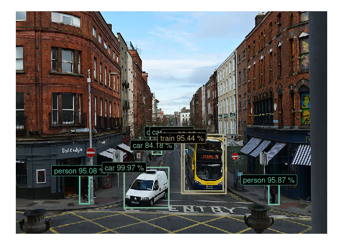
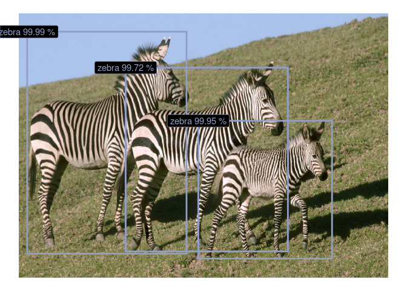
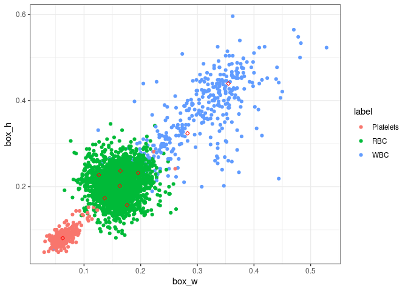
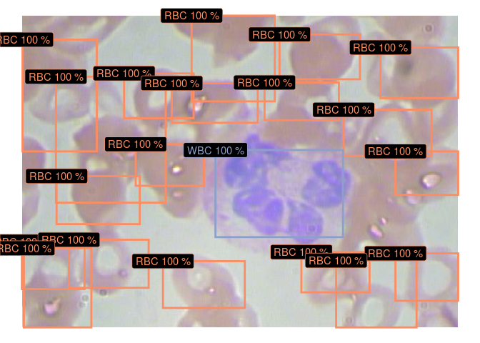
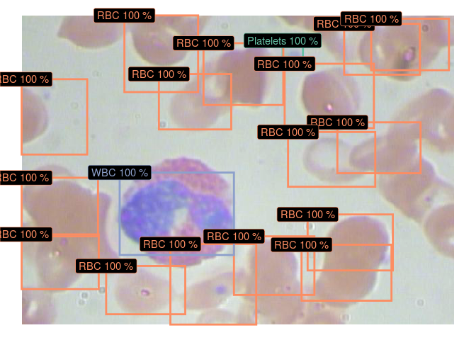

platypus
========

**R package for object detection and image segmentation**

With `platypus` it is easy create advanced computer vision models like
YOLOv3 and U-Net in a few lines of code.

How to install?
---------------

You can install the latest version of `platypus` with `remotes`:

``` r
remotes::install_github("maju116/platypus")
```

(`master` branch contains the stable version. Use `develop` branch for
latest features)

To install [previous versions]() you can run:

``` r
remotes::install_github("maju116/platypus", ref = "0.1.0")
```

In order to install `platypus` you need to install `keras` and
`tensorflow` packages and `Tensorflow` version `>= 2.0.0`
(`Tensorflow 1.x` will not be supported!)

YOLOv3 Object detection with pre-trained COCO weights:
------------------------------------------------------

To create `YOLOv3` architecture use:

``` r
library(tidyverse)
library(platypus)
library(abind)

test_yolo <- yolo3(
  net_h = 416, # Input image height
  net_w = 416, # Input image width
  grayscale = FALSE, # Should images be loaded as grayscale or RGB
  n_class = 80, # Number of object classes (80 for COCO dataset)
  anchors = coco_anchors # Anchor boxes
)

test_yolo
#> Model
#> Model: "yolo3"
#> ________________________________________________________________________________
#> Layer (type)              Output Shape      Param #  Connected to               
#> ================================================================================
#> input_img (InputLayer)    [(None, 416, 416, 0                                   
#> ________________________________________________________________________________
#> darknet53 (Model)         multiple          40620640 input_img[0][0]            
#> ________________________________________________________________________________
#> yolo3_conv1 (Model)       (None, 13, 13, 51 11024384 darknet53[1][2]            
#> ________________________________________________________________________________
#> yolo3_conv2 (Model)       (None, 26, 26, 25 2957312  yolo3_conv1[1][0]          
#>                                                      darknet53[1][1]            
#> ________________________________________________________________________________
#> yolo3_conv3 (Model)       (None, 52, 52, 12 741376   yolo3_conv2[1][0]          
#>                                                      darknet53[1][0]            
#> ________________________________________________________________________________
#> grid1 (Model)             (None, 13, 13, 3, 4984063  yolo3_conv1[1][0]          
#> ________________________________________________________________________________
#> grid2 (Model)             (None, 26, 26, 3, 1312511  yolo3_conv2[1][0]          
#> ________________________________________________________________________________
#> grid3 (Model)             (None, 52, 52, 3, 361471   yolo3_conv3[1][0]          
#> ================================================================================
#> Total params: 62,001,757
#> Trainable params: 61,949,149
#> Non-trainable params: 52,608
#> ________________________________________________________________________________
```

You can now load [YOLOv3 Darknet](https://pjreddie.com/darknet/yolo/)
weights trained on [COCO dataset](https://cocodataset.org/#home).
Download pre-trained weights from
[here](https://pjreddie.com/media/files/yolov3.weights) and run:

``` r
test_yolo %>% load_darknet_weights("development/yolov3.weights")
```

Calculate predictions for new images:

``` r
test_img_paths <- list.files(system.file("extdata", "images", package = "platypus"), full.names = TRUE, pattern = "coco")
test_imgs <- test_img_paths %>%
  map(~ {
    image_load(., target_size = c(416, 416), grayscale = FALSE) %>%
      image_to_array() %>%
      `/`(255)
  }) %>%
  abind(along = 4) %>%
  aperm(c(4, 1:3))
test_preds <- test_yolo %>% predict(test_imgs)

str(test_preds)
#> List of 3
#>  $ : num [1:2, 1:13, 1:13, 1:3, 1:85] 0.294 0.478 0.371 1.459 0.421 ...
#>  $ : num [1:2, 1:26, 1:26, 1:3, 1:85] -0.214 1.093 -0.092 2.034 -0.286 ...
#>  $ : num [1:2, 1:52, 1:52, 1:3, 1:85] 0.242 -0.751 0.638 -2.419 -0.282 ...
```

Transform raw predictions into bounding boxes:

``` r
test_boxes <- get_boxes(
  preds = test_preds, # Raw predictions form YOLOv3 model
  anchors = coco_anchors, # Anchor boxes
  labels = coco_labels, # Class labels
  obj_threshold = 0.6, # Object threshold
  nms = TRUE, # Should non-max suppression be applied
  nms_threshold = 0.6, # Non-max suppression threshold
  correct_hw = FALSE # Should height and width of bounding boxes be corrected to image height and width
)

test_boxes
#> [[1]]
#>        xmin      ymin      xmax      ymax     p_obj label_id  label
#> 1 0.2065822 0.7178876 0.2364099 0.8651962 0.9507609        1 person
#> 2 0.8122054 0.7581823 0.8457879 0.8682902 0.9587147        1 person
#> 3 0.3485442 0.7018576 0.4919897 0.8842886 0.9997346        3    car
#> 4 0.4835574 0.5431118 0.4976843 0.5575383 0.8372639        3    car
#> 5 0.5016635 0.5427939 0.5154415 0.5558958 0.8209396        3    car
#> 6 0.4394382 0.6041225 0.4685148 0.6429721 0.8417721        3    car
#> 7 0.5407435 0.5537741 0.6669978 0.8086006 0.9994573        6    bus
#> 8 0.5340163 0.5701706 0.6751449 0.8193321 0.9543661        7  train
#> 
#> [[2]]
#>         xmin       ymin      xmax      ymax     p_obj label_id label
#> 1 0.02362738 0.07048325 0.4544083 0.9091996 0.9999467       23 zebra
#> 2 0.28961027 0.20582033 0.7285326 0.9007657 0.9972296       23 zebra
#> 3 0.48607180 0.40705788 0.8476524 0.9278796 0.9995333       23 zebra
```

Plot / save images:

``` r
plot_boxes(
  images_paths = test_img_paths, # Images paths
  boxes = test_boxes, # Bounding boxes
  correct_hw = TRUE # Should height and width of bounding boxes be corrected to image height and width
)
```



YOLOv3 Object detection with custom dataset:
--------------------------------------------

Download images and annotations: [BCCD
dataset](https://www.kaggle.com/surajiiitm/bccd-dataset?)

Generate custom anchor boxes:

``` r
library(tidyverse)
library(platypus)
library(abind)

blood_labels <- c("Platelets", "RBC", "WBC")
n_class <- length(blood_labels)
net_h <- 416
net_w <- 416
anchors_per_grid <- 3
annot_path <- "development/BCCD/Annotations/"
images_path <- "development/BCCD/JPEGImages/"

blood_anchors <- generate_anchors(
  anchors_per_grid = anchors_per_grid, # Number of anchors (per one grid) to generate
  annot_path = annot_path, # Annotations directory
  labels = blood_labels, # Class labels
  n_iter = 10, # Number of k-means++ iterations
  annot_format = "pascal_voc", # Annotations format
  seed = 55, # Random seed
  centroid_fun = mean # Centroid function
)
#>       label    n
#> 1 Platelets  361
#> 2       RBC 4153
#> 3       WBC  372
```



``` r
blood_anchors
#> [[1]]
#> [[1]][[1]]
#> [1] 0.3552235 0.4417515
#> 
#> [[1]][[2]]
#> [1] 0.2911290 0.3292675
#> 
#> [[1]][[3]]
#> [1] 0.1971296 0.2346442
#> 
#> 
#> [[2]]
#> [[2]][[1]]
#> [1] 0.1757463 0.1592062
#> 
#> [[2]][[2]]
#> [1] 0.1652637 0.2065506
#> 
#> [[2]][[3]]
#> [1] 0.1630269 0.2439239
#> 
#> 
#> [[3]]
#> [[3]][[1]]
#> [1] 0.1391842 0.1769376
#> 
#> [[3]][[2]]
#> [1] 0.1245985 0.2258089
#> 
#> [[3]][[3]]
#> [1] 0.06237392 0.08062560
```

Build `YOLOv3` model and compile it with correct loss and metric:

``` r
blood_yolo <- yolo3(net_h = net_h, net_w = net_w, n_class = n_class)
blood_yolo %>% load_darknet_weights("development/yolov3.weights") # Optional

blood_yolo %>% compile(
  optimizer = optimizer_adam(lr = 1e-5),
  loss = yolo3_loss(blood_anchors, n_class = n_class),
  metrics = yolo3_metrics(blood_anchors, n_class = n_class)
)
```

Create data generator:

``` r
blood_yolo_generator <- yolo3_generator(
  annot_path = annot_path,
  images_path = images_path,
  net_h = net_h, net_w = net_w,
  batch_size = 16,
  shuffle = FALSE,
  labels = blood_labels
)
```

Fit the model:

``` r
blood_yolo %>%
  fit_generator(
    blood_yolo_generator,
    epochs = 100,
    steps_per_epoch = 23,
    callbacks = list(callback_model_checkpoint("development/BCCD/blood_w.hdf5",
                                               save_best_only = TRUE,
                                               save_weights_only = TRUE)
)
```

Predict on new images:

``` r
blood_yolo <- yolo3(net_h = net_h, net_w = net_w, n_class = n_class)
blood_yolo %>% load_model_weights_hdf5("development/BCCD/blood_w.hdf5")

test_img_paths <- list.files(system.file("extdata", "images", package = "platypus"), full.names = TRUE, pattern = "blood")

test_imgs <- test_img_paths %>%
  map(~ {
    image_load(., target_size = c(net_h, net_w), grayscale = FALSE) %>%
      image_to_array() %>%
      `/`(255)
  }) %>%
  abind(along = 4) %>%
  aperm(c(4, 1:3))
test_preds <- blood_yolo %>% predict(test_imgs)

test_boxes <- get_boxes(test_preds, blood_anchors, blood_labels,
                        obj_threshold = 0.6)

plot_boxes(images_paths = test_img_paths, boxes = test_boxes)
```


