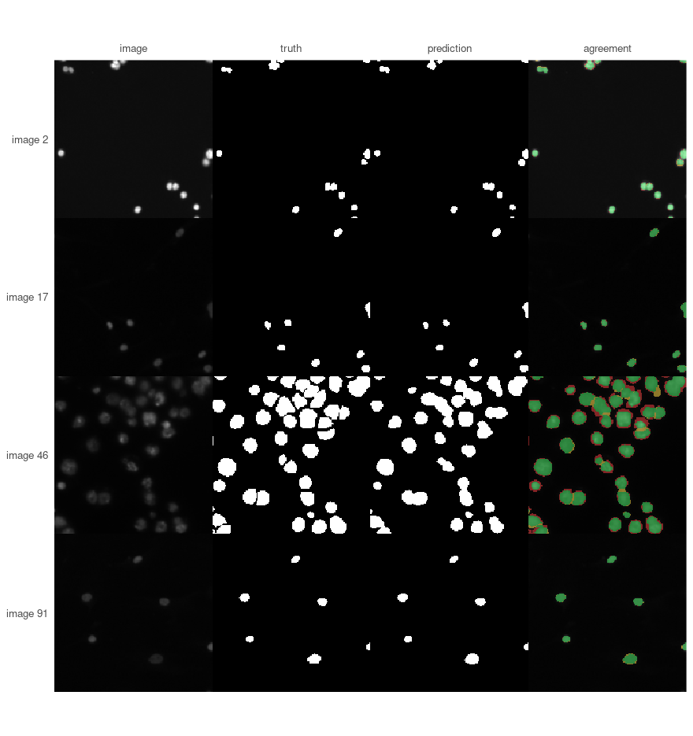

# platypus

**Segmentation for medical images, from a folder of pictures to a figure.**

<!-- badges: start -->
[](https://github.com/maju116/platypus/actions/workflows/R-CMD-check.yaml)
<!-- badges: end -->

> **This is a rewrite, and an alpha.** The package released in 2020 was built on
> TensorFlow through the R keras package. This one runs on PyTorch through
> [pyplatypus](https://pypi.org/project/pyplatypus/), which it installs and isolates for
> you. The API is different and will still move. The old version is on the `master`
> branch.

R has excellent tools for reading medical images and a healthy deep learning stack, and
almost nothing joining them: as of August 2025 the CRAN Task View for *Medical Image
Analysis* listed no deep learning packages at all. This is an attempt at the missing
piece — not a wrapper around a Python library you then have to learn, but an R package
that happens to compute in Python.

## Installing

```r
# install.packages("remotes")
remotes::install_github("maju116/platypus")
```

There is nothing to set up afterwards. The first call that needs the engine builds an
isolated Python environment for it, and everything after that uses the cache. You never
choose an interpreter, activate anything, or match a version.

## A worked example

```r
library(platypus)

spec <- platypus_spec(
  data = segmentation_data(
    train      = "stage1_train",
    validation = "stage1_validation",
    colormap   = binary_colormap
  ),
  models = list(
    u_net("unet", input_shape = c(160, 160),
          loss    = loss_cce_dice(),
          metrics = list(metric_dice(include_background = FALSE)),
          epochs  = 12),
    linknet("linknet", input_shape = c(160, 160),
            loss    = loss_focal_tversky(alpha = 0.7),
            metrics = list(metric_dice(include_background = FALSE)),
            epochs  = 12)
  )
)

fit <- platypus_fit(spec)
evaluate(fit)
#>     model architecture loss_function parameters epochs_run  loss  dice   iou
#> 1    unet        u_net      cce_dice    1942594         12 0.096 0.878 0.797
#> 2 linknet      linknet focal_tversky    1746754         12 0.071 0.881 0.797
```

Read that `loss` column with care, which is why `loss_function` sits beside it: two models
trained on different objectives are not on a common scale. The metrics are comparable,
because they measure the mask rather than the objective.

Then look at what it did, which is the part a score cannot do for you:

```r
plot_masks(images, prediction = predict(fit, "unet"), truth = truth,
           colormap = binary_colormap)
```



Green is what was found, red what was missed, yellow what was invented. Here nearly all of
the red is a thin rim around nuclei that were otherwise located correctly — the model
draws them slightly too small. If the question is *how many nuclei*, that hardly matters;
if it is *how large*, it is the whole answer. No single overlap score tells those apart.

The full walk-through is in `vignette("data-science-bowl")`.

## The same thing from a file

```r
spec <- platypus_spec("experiment.yaml")
```

Arguments and YAML produce the same object, and nothing downstream can tell which was
used — so a configuration file and an R script describe the same experiment, and either
can be handed to a colleague.

## What is in it

**Four architectures** — U-Net, U-Net++, Res-U-Net and LinkNet — composable with separable
convolutions, spatial dropout, interpolated or learned upsampling, deep supervision and
block width.

**Nine losses** (IoU, Dice, cross-entropy, CCE-Dice, Focal, Tversky, Focal-Tversky, Combo,
Lovász) and **three metrics**, each of which can leave the background out. In medical
images the background is usually most of the picture, and averaging it in turns a model
that found nothing into one that looks respectable.

**Tiling that goes both ways** — cut a large image into a grid instead of shrinking it, and
get a full-size mask back.

**One channel per file.** `channels_from = c("_t1\\.nii", "_t1ce\\.nii", "_t2\\.nii",
"_flair\\.nii")` stacks four MRI sequences per patient in the order you name, which is how
BraTS ships and how satellite bands arrive. The order is stated rather than inferred: sorted,
those names come out flair, t1, t1ce, t2 — reproducible and anatomically meaningless, and a
model trained with FLAIR in channel one answers plausibly on data where channel one is T1.

**Volumes.** NIfTI or a folder of DICOM slices in, 3D U-Net out, patches through the same
tiling. `target_spacing = c(1, 1, 1)` resamples every scan to a common voxel size and then
crops or pads to the model's shape, rather than squeezing each one into the same box — forty
slices of 1 mm is 40 mm of patient and forty of 2.5 mm is 100 mm, so resizing alone leaves the
same organ a different size in each. `series_report()` checks a whole export before anything trains — reading no pixels,
one row per folder — and says which series have a missing slice, duplicated files, or two
series sitting in one directory. A gap matters more than it sounds: it does not shorten a
volume, it moves everything past it, and no metric would show that. Masks are label maps
(`labels = c(0, 1)`) rather than colours, because that is how volume formats store them.
`save_volumes()` writes predictions as NIfTI carrying the geometry of the scan they came
from — a mask without that affine cannot be laid over its scan by any viewer — and
`mask_volume()` reports a segmented structure in millilitres, which is the number that goes
in a report, not a voxel count that means nothing outside one scanner.

**Splitting by patient, not by slice.** `platypus_split()` divides one directory into
training, validation and test sets and keeps every group whole; the result goes straight
into `segmentation_data()`. This is the most common way a segmentation result comes out
several points too good: a scan is many slices of one patient, so splitting at random puts
the same anatomy on both sides and validation ends up measuring memory. A `group_by`
pattern that matches nothing is an error, never a quiet fallback.

**A score per case, not one per dataset.** `evaluate_cases()` reports each image — or each
patient — and `summary()` gives the distribution and names the worst one. On the Data
Science Bowl a model averaging Dice 0.855 turned out to score 0.006 on three images. The
mean had no way of saying so.

**Augmentation in 3D**, with `available_augmentations(rank = 3)` to say what can be used on a
volume — albumentations supports them unevenly, and a transform that cannot is refused by name
when the run starts rather than raising `KeyError: 'images'` from inside the library an hour in.

**The parts that make an analysis fast**, which is what the package was always for:
combining the per-object mask files that datasets like the Data Science Bowl ship,
converting between class indices and colours, overlaying, and drawing the comparison
above. These work on ordinary R arrays and need no Python at all.

## Learning it

Two vignettes, both precomputed from real runs — every number and figure in them came out of
running the code shown.

`vignette("data-science-bowl")` is two-dimensional microscopy: the 2018 Data Science Bowl, one
mask per nucleus, from a folder of images to a figure.

`vignette("volumes")` is CT, and generates its own synthetic data so it can be run without
downloading anything: voxel spacing, splitting by patient, resampling, per-patient scores, a
slice to look at, and the size of a finding in millilitres. It ends on something worth knowing —
a model at Dice 0.88 whose volumes were 12% to 23% too large, which is not a contradiction and
is the reason to report both.

## What is not in it yet

Object detection, ensembling, pretrained encoders. Augmentation in 3D, which albumentations
offers through a different call signature — a 3D specification asking for it is refused
rather than quietly ignored. Resampling volumes to isotropic spacing: the spacing is read
and reported by `volume_info()`, but applying it changes the voxel grid the model sees, and
that is a decision to take deliberately rather than inside a reader.

The package is **not on CRAN**: the name collides, case-insensitively, with an unrelated
immunology package archived there in February 2026. That is being taken up with CRAN.

## About the engine

`pyplatypus` is installed automatically into an environment kept apart from any other
Python on the machine. This matters because the R keras and tensorflow packages of 2020
shared one installation with everything else, and an unrelated change could break an R
session. Nothing here touches a Python anyone else uses.

Three things worth knowing.

**The first call downloads about 5 GB**, most of it CUDA libraries that PyTorch ships by
default whether or not there is a GPU. It is cached afterwards, and everything works
offline once it is — which is the install path for a machine without internet access: run
it once somewhere with a connection and carry `~/.cache/uv` across.

**On a GeForce GTX 10-series card or older**, ask for the older PyTorch first:

```r
library(platypus)
platypus_use_torch("pascal")
```

PyTorch 2.8 onwards ships CUDA 13 builds, and CUDA 13 dropped that whole generation of
cards. Without this, everything runs on the processor instead — perhaps ten times slower,
with nothing obviously wrong. `platypus_device()` will tell you which is happening.

**If the engine will not start and the error says there is no such version of
pyplatypus**, the version does exist and uv is answering from a cached copy of the package
index — likely because the engine was published minutes ago. Clear that one entry:

```bash
uv cache clean pyplatypus
```

## Licence

MIT.
