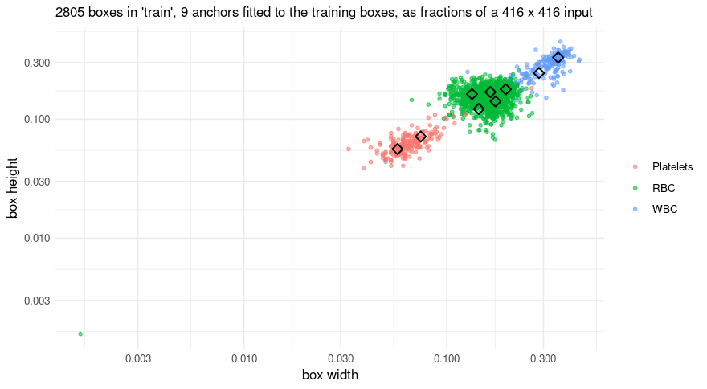
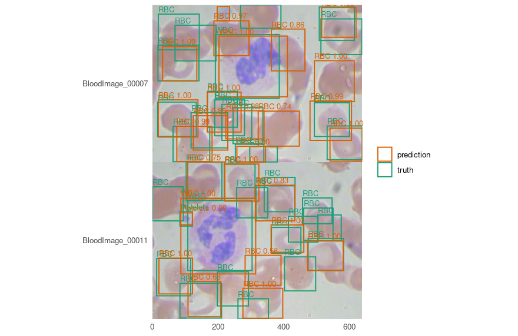

# Finding blood cells with YOLOv3

Segmentation asks which pixels are tissue. Detection asks how many
objects there are and where, which is a different question and needs a
different answer: boxes, not masks.

[BCCD](https://github.com/Shenggan/BCCD_Dataset) is 364 photographs of
blood smears with 4,888 boxes in three classes - red cells, white cells,
platelets - and its own train/validation/test split. It is small, it is
MIT-licensed, and its classes are wildly unbalanced, which turns out to
be the most instructive thing about it.

Every number and every picture below was produced by running the code
shown.

## Before any of that: boxes in a few lines

A detector trained on this data is published, so the shortest way to see
whether this works is to borrow it. No training, no GPU, no waiting.

A detection dataset arrives in Pascal VOC’s layout - one flat directory
of images beside one flat directory of XML - which is neither of the two
layouts the package reads. Turning it into one is the only data
wrangling here, and it is a dozen lines:

``` r

voc_split <- function(root, listed) {
  names <- readLines(file.path(root, "ImageSets", "Main", paste0(listed, ".txt")))
  names <- names[nzchar(names)]
  frame <- data.frame(
    key = names,
    images = file.path(root, "JPEGImages", paste0(names, ".jpg")),
    # `annotations`, not `masks`: a detection specification looks for that column, because
    # what labels an image here is an annotation file and not a picture.
    annotations = file.path(root, "Annotations", paste0(names, ".xml"))
  )
  path <- file.path(tempdir(), paste0("bccd-", listed, ".csv"))
  write.csv(frame, path, row.names = FALSE)
  path
}

splits <- vapply(c("train", "val", "test"), function(s) voc_split(data_dir, s),
                 character(1))
vapply(splits, function(p) nrow(read.csv(p)), integer(1))
#> train   val  test 
#>   205    87    72
```

BCCD’s own split, not one invented here - which is the only reason the
numbers below can be compared with anybody else’s on this dataset.

``` r

cells <- c("RBC", "WBC", "Platelets")

published <- platypus_spec(
  data = detection_data(splits[["train"]], splits[["val"]], test = splits[["test"]],
                        classes = cells, mode = "config_file"),
  models = list(yolo3("cells", input_shape = c(416, 416),
                      weights = "bccd-yolo3", fit = FALSE))
)
#> Warning: Some Python package requirements declared via `py_require()` are not installed in the selected Python environment: (/home/maju116/.cache/uv/archive-v0/wjRRjivfnRhbB-9U8b51r/bin/python)
#> 
borrowed <- platypus_fit(published, verbose = FALSE)
found <- predict(borrowed, split = "test")
length(found)
#> [1] 72
head(found[[1]], 4)
#>        xmin     ymin     xmax     ymax     score label name
#> 1  19.93539 300.9871 139.2865 392.0793 0.9999792     1  RBC
#> 2  27.77121 126.9517 140.5794 234.9014 0.9999719     1  RBC
#> 3 492.09385 303.5892 603.1343 396.8544 0.9999502     1  RBC
#> 4 213.10871  99.1100 404.4725 275.4815 0.9996140     2  WBC
```

One data frame per image, named by the sample key, in the **photograph’s
own pixels** - so the boxes land on the picture without anything being
undone first:

``` r

names(found)[1:2]
#> [1] "BloodImage_00007" "BloodImage_00011"
files <- read.csv(splits[["test"]])
images <- read_images(files$images[1:2], size = NULL)

plot_boxes(images, found[1:2], min_score = 0.5)
```


plot of chunk bccd-published-plot

### And here, unlike the nuclei vignette, a score means something

Those weights were trained on BCCD’s 205 training images. This is its 72
test images, which the model has never seen, so measuring on them is
honest:

``` r

evaluate(borrowed, split = "test")[, c("map_50", "map_50_95", "mean_matched_iou")]
#>      map_50 map_50_95 mean_matched_iou
#> 1 0.8570754 0.5003368        0.8058061
```

That is the figure on the model card, which anybody can check:

``` r

available_weights()[available_weights()$name == "bccd-yolo3", c("name", "revision")]
#>         name                                 revision
#> 1 bccd-yolo3 24fbff0833455a747c7bac9c2b8dc43073ce4e82
```

**The description in that table is the part to read before trusting
them.** Published is the *median* of five seeds rather than the best -
the spread is wide enough that a single number would be whichever seed
was reported - and platelets are the unreliable class, which the next
section shows rather than asserts.

### One refusal worth meeting now

A detector’s weights decode boxes **relative to the anchors they were
trained with**. Read with any others, the same numbers produce boxes
scaled by a fixed factor: plausible boxes, plausible scores, wrong
places, and nothing in any output to say so. So loading takes the
anchors recorded beside the file, and a specification that also names
some is two claims about one model with one of them untrue:

``` r

yolo3("cells", input_shape = c(416, 416), weights = "bccd-yolo3",
      anchors = list(list(c(0.3, 0.3)), list(c(0.2, 0.2)), list(c(0.1, 0.1))))
#> Error:
#> ! give `weights` or `anchors`, not both. A detector's weights decode boxes relative to the anchors they were trained with, so loading uses the ones recorded beside the file - which would leave these describing nothing.
```

Refused before anything was built. Everything below trains from scratch
instead, which is what you will do on your own data.

## Anchors, which a detector has and a U-Net does not

YOLOv3 does not predict a box from nothing. It predicts a correction to
one of nine **anchors** - fixed shapes, three per grid - and which
anchors you use decides how much correcting is left to learn. Unset,
they are fitted to your own boxes:

``` r

spec <- platypus_spec(
  data = detection_data(splits[["train"]], splits[["val"]], test = splits[["test"]],
                        classes = cells, mode = "config_file"),
  models = list(yolo3(
    "cells",
    input_shape = c(416, 416),
    epochs = 150,
    batch_size = 8,
    optimizer = optimizer_adam(learning_rate = 1e-4),
    # A smear has no up or down, and a left-right flip is free: the boxes follow it
    # exactly, with no interpolation and no rounding.
    augmentation = list(augmentation_step("HorizontalFlip", p = 0.5)),
    callbacks = list(callback_cosine_annealing())
  )),
  seed = 1
)

fit <- platypus_fit(spec, verbose = FALSE)
```

``` r

anchors <- detection_anchors(fit)
anchors$fitted
#> [1] TRUE
round(anchors$mean_iou, 4)
#> [1] 0.8772
anchors$per_anchor[, c("grid", "slot", "width_pixels", "height_pixels", "boxes",
                       "mean_iou")]
#>   grid slot width_pixels height_pixels boxes  mean_iou
#> 1    0    0    147.38592     137.40874   103 0.8696796
#> 2    0    1    118.59296     101.74789    71 0.8102370
#> 3    0    2     81.30258      74.30011   445 0.8863117
#> 4    1    0     68.32447      70.38699   803 0.9089707
#> 5    1    1     72.38382      58.75508   581 0.8836537
#> 6    1    2     55.40458      67.64656   349 0.8541086
#> 7    2    0     59.82368      50.76842   247 0.8363835
#> 8    2    1     30.99390      29.78902    82 0.8265114
#> 9    2    2     23.79106      23.37358   123 0.8322202
```

Fitted anchors cover these boxes at a mean overlap of 0.88. COCO’s own
nine, borrowed, manage 0.65 on the same boxes - which is the difference
between a correction and a rewrite, and it costs nothing to avoid.

**A mean hides which class it is made of.** A coverage of 0.65 is either
“every class covered adequately” or “two covered well and the third not
at all”, and those want different fixes. The picture tells them apart:

``` r

plot_anchors(fit, log = TRUE)
```



plot of chunk bccd-anchor-plot

Each point is one annotated box - its width against its height, both as
fractions of the 416 x 416 input - and the diamonds are the anchors. Log
axes, because the fitted anchors alone run from 24 to 147 pixels a side,
and on linear ones the smallest class collapses into the corner.

Three clouds, because the three cell types are three sizes, and a
diamond near each one. The diamonds are not spread evenly: most sit in
the crowded middle where the red cells are, which is k-means doing
exactly what it was asked - put the anchors where the boxes are, not
where the classes are.

**And one point sits far below everything else, at about two thirds of a
pixel a side.** That is not a drawing error and not an outlier in the
statistical sense - it is a bad row. BCCD carries one annotation of zero
extent in the training split and another in the validation split, and a
zero-width box read under Pascal VOC’s inclusive convention comes out
one pixel across. k-means drops it, because an overlap with a box that
has no area is undefined, which is why the anchors above were fitted to
2,804 boxes while the picture draws 2,805. The plot keeps it
deliberately: a dataset’s bad rows are worth seeing once, and this is
the only place in the whole run where that one is visible at all.

It is also the clearest way to see why COCO’s nine manage only 0.65
here. Those span 10 to 373 pixels a side, because COCO holds objects of
every size; these three cell types span about 6-fold. Most of that range
is spent on boxes this dataset does not contain.

Worth drawing for the split they were *not* fitted on. Anchors covering
the training boxes well and the validation boxes badly would say the two
halves hold different objects, and no training curve shows that:

``` r

plot_anchors(fit, split = "validation", log = TRUE)
```


plot of chunk bccd-anchor-plot-valid

## What the loss is doing

``` r

tail(fit$history[, c("epoch", "train_loss", "train_coordinates", "train_objectness",
                     "val_loss")], 3)
#>     epoch train_loss train_coordinates train_objectness val_loss
#> 148   148   5.922305          5.918050     0.0006400742 9.771855
#> 149   149   5.925872          5.921553     0.0006455596 9.768552
#> 150   150   5.946499          5.942215     0.0006420772 9.850832
```

**The total does not reach zero and that is not a stall.** Cross-entropy
against a soft target bottoms out at the target’s own entropy, so the
coordinate term has a floor above zero that depends on the data. Which
is exactly why the four parts are reported separately: a total of 5.95
means nothing alone, while `coordinates 5.94` beside
`objectness 6.4 &times; 10<sup>-4</sup>` says the model has learned what
is where and is still refining the boxes.

## Scoring, and the number that is missing on purpose

``` r

evaluate(fit, split = "test")
#>   model architecture parameters epochs_run    map_50 map_50_95 mean_matched_iou
#> 1 cells        yolo3   61534504        150 0.8661176  0.513187        0.8064532
#>   n_truth n_predicted classes_without_truth
#> 1     945        2817                     0
```

**This run’s `map_50` of 0.8661 sits inside the range of the five in the
table further down (0.853 to 0.887), and that is the point of the table
rather than a problem with it.** A seed pins which random numbers are
drawn; it does not pin the order they are consumed in, and the number of
loader workers - `num_workers = "auto"` here, four in the script that
produced the published weights - changes that order. So “the same seed”
means the same recipe on one machine with one worker count, and not a
guarantee of the same number. Knits of this very document at the same
seed have differed by more than a point of `map_50`, which is how the
paragraph you are reading came to be written: the first version of it
quoted a number, and the next knit disagreed with it.

Which is the argument for reading `mean_matched_iou` first, and it holds
here: the overlap came out at 0.8065 against the five-run mean of
0.8040, a difference of 0.0024.

There is no overall precision and no overall recall in that table, and
the absence is deliberate. Averaging them over classes needs a
weighting, and every choice of weighting is a different claim: over
BCCD’s 4,155 red cells, 372 white and 361 platelets, a single precision
is a statement about red cells wearing the costume of a statement about
the model.

Per class is the form in which they mean something:

``` r

evaluate_classes(fit, split = "test")
#>       class average_precision mean_matched_iou n_truth n_predicted precision
#> 1       RBC         0.7971192        0.8089451     805         904 0.7168142
#> 2       WBC         0.9634323        0.8523577      71          77 0.9220779
#> 3 Platelets         0.8378013        0.7311496      69         111 0.5855856
#>      recall
#> 1 0.8049689
#> 2 1.0000000
#> 3 0.9420290
```

Read that table rather than the mean. White cells are nearly perfect -
there is one per image and it is large. Platelets come back at a
precision of 0.59 at this confidence, meaning 41% of the platelets
reported are not there, and their boxes fit worst of the three at an
overlap of 0.73.

### <mAP@0.5>, mAP@\[.50:.95\], and which to believe

Two averages and they answer different questions. The first asks whether
an object was found; the second averages over ten overlap thresholds and
so also asks how well the box fits. The gap between them is
localisation, and `mean_matched_iou` says that in one number instead of
through a difference.

On this dataset, **the overlap is far steadier than the average
precision**. Five runs of the recipe above, differing only in the seed -
and measured with the engine on its own, four loader workers, rather
than through this vignette:

|                           | mean   | sd         |
|---------------------------|--------|------------|
| <mAP@0.5>                 | 0.8660 | 0.0159     |
| mAP@\[.50:.95\]           | 0.5159 | 0.0199     |
| mean IoU of matched boxes | 0.8041 | **0.0026** |

Six times steadier. Which rank the model gives a borderline platelet
moves average precision and leaves the overlap alone - so on a dataset
this size, a point of mAP is not a result, and `mean_matched_iou` is the
number to read first. That is not a general law about detection; it is
what these 364 images do, and it was found by running five seeds rather
than one.

## Looking at it

The comparison is the point. Truth in one colour, predictions in
another, on the same image:

``` r

truth <- lapply(read.csv(splits[["test"]])$annotations[1:2], function(path) {
  xml <- readLines(path, warn = FALSE)
  nodes <- regmatches(paste(xml, collapse = ""),
                      gregexpr("<object>.*?</object>", paste(xml, collapse = "")))[[1]]
  pull <- function(node, tag) {
    as.numeric(sub(paste0(".*<", tag, ">([^<]*)</", tag, ">.*"), "\\1", node))
  }
  data.frame(
    # Pascal VOC is 1-based and inclusive of both ends, so a box written xmin=1 xmax=10 is
    # 0..10 as a continuous interval. Reading it as 0-based shifts every box by a pixel and
    # shrinks it by one - invisible by eye, and real IoU on a platelet 41 pixels across.
    xmin = vapply(nodes, pull, numeric(1), "xmin") - 1,
    ymin = vapply(nodes, pull, numeric(1), "ymin") - 1,
    xmax = vapply(nodes, pull, numeric(1), "xmax"),
    ymax = vapply(nodes, pull, numeric(1), "ymax"),
    name = sub(".*<name>([^<]*)</name>.*", "\\1", nodes)
  )
})

mine <- predict(fit, split = "test")
plot_boxes(images, mine[1:2], truth = truth, min_score = 0.5)
```



plot of chunk bccd-compare

A detector that found the right number of objects in the wrong places
and one that found the wrong number in the right places score similarly
and look nothing alike, which is why this picture is worth more than
either average.

## What this does not do

**It is not a cell count.** A precision of 0.59 on platelets means a
count taken from these boxes is too high by about 71%. Counting needs
either a better model for the small class or a threshold chosen for
counting rather than for a figure, and either way it needs measuring
against truth on your own data.

**It is one small collection.** 205 training images at one
magnification, stained one way. BCCD is a demonstration dataset.

**It is not a diagnostic tool**, and a result from it is not a
laboratory result.

## Notes on the machine

Trained on a GTX 1070: 150 epochs, about 37 minutes. YOLOv3 is 61.5
million parameters, thirty times a U-Net at the settings in the nuclei
vignette, so this is the one place in the package where the hardware
matters.

A card of that generation needs the CUDA 12 build of PyTorch, which
`platypus_use_torch("pascal")` selects - see
[`?platypus_device`](https://maju116.github.io/platypus/reference/platypus_device.md).
Without it the run falls back to the processor, and the warning that
says so is printed before the wait rather than after, because a run that
quietly went to the CPU looks exactly like a run that is simply slow.
