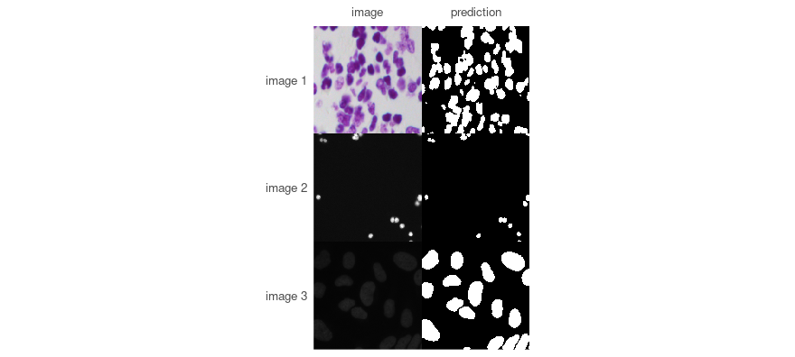
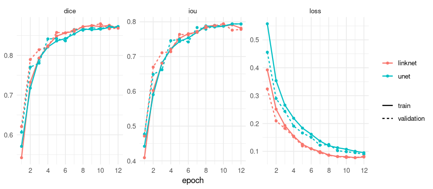
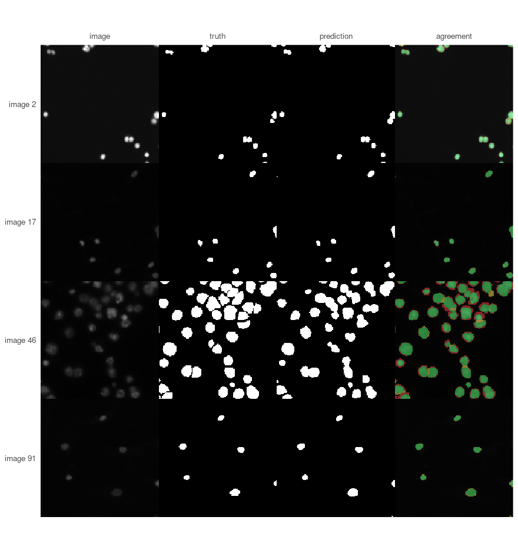

# Finding nuclei in the 2018 Data Science Bowl

The [2018 Data Science
Bowl](https://www.kaggle.com/c/data-science-bowl-2018) asked for the
nuclei in microscopy images: several hundred pictures, taken down
different microscopes under different stains, each with its nuclei
outlined. It is a good first problem because it is genuinely varied and
genuinely small.

This walks through it end to end. Every number and every picture below
was produced by running the code shown.

## Before any of that: a mask in four lines

A model trained on this data is published, so the shortest way to see
whether the package does anything useful is to borrow it. No training,
no waiting:

``` r

validation_dir <- file.path(data_dir, "stage1_validation")

published <- platypus_spec(
  data = segmentation_data(validation_dir, validation_dir, colormap = binary_colormap),
  models = list(u_net("nuclei", input_shape = c(256, 256), blocks = 4, filters = 16,
                      weights = "dsbowl-unet", fit = FALSE))
)
borrowed <- platypus_fit(published, verbose = FALSE)
masks <- predict(borrowed, split = "validation")
dim(masks)
#> [1] 134 256 256
```

``` r

found <- list.files(validation_dir, pattern = "[.]png$", recursive = TRUE, full.names = TRUE)
images <- read_images(head(grep("/images/", found, value = TRUE), 3), size = c(256, 256))
plot_masks(images, prediction = masks[1:3, , ], colormap = binary_colormap,
           which = 1:3)
```



plot of chunk published-plot

The weights came down from the Hub on first use and are cached
afterwards, so running this again costs nothing.

**No score is reported here, on purpose.** This directory and the one
the weights were trained on come from the same collection and overlap,
so anything measured here would flatter the model. The numbers that mean
something were measured on a held-out split when the weights were
published, and travel with them:

``` r

available_weights()[, c("name", "revision")]
#>          name                                 revision
#> 1 dsbowl-unet 5e035c6a39827c33e19507affb9415c3908ae383
```

The description in that table is the part to read before trusting them -
these are *semantic*, so touching nuclei come back as one region and a
count taken from them would be wrong.

One thing worth meeting here rather than later. Weights belong to an
exact model, not to a task, and the rest of this vignette trains at 160
x 160 while these were trained at 256:

``` r

mismatched <- platypus_spec(
  data = segmentation_data(validation_dir, validation_dir, colormap = binary_colormap),
  models = list(u_net("nuclei", input_shape = c(160, 160), blocks = 4, filters = 16,
                      weights = "dsbowl-unet", fit = FALSE))
)
platypus_fit(mismatched)
#> Error in `platypus_fit()`:
#> ! 'dsbowl-unet' was trained for a different model:
#>   - input_shape: weights say (256, 256), the model says (160, 160)
#> Loading anyway would either fail inside torch or, where the shapes happen to agree, produce a model that predicts confidently and means nothing.
```

Refused, with the field that differs, before anything was loaded. That
check exists because the failure it prevents is silent: weights trained
on a different colormap with the same number of classes load perfectly
and predict nonsense.

Everything below trains a model from scratch instead, which is what you
will actually do on your own data - the published weights are a
demonstration and a baseline, not an answer to your problem.

## The data

One directory per image, each holding an `images` and a `masks`
subdirectory. The masks subdirectory holds **one file per nucleus**,
which is common enough that `platypus` combines them for you.

``` r

data_dir <- "data_science_bowl"
```

``` r

train <- file.path(data_dir, "stage1_train")
valid <- file.path(data_dir, "stage1_validation")

length(list.dirs(train, recursive = FALSE))     # images
#> [1] 536
length(list.files(file.path(list.dirs(train, recursive = FALSE)[1], "masks")))  # masks in the first
#> [1] 27
```

## Look at it before training on it

The most useful thing to know before choosing anything else is how much
of each picture is actually the thing you are looking for.

``` r

foreground <- function(sample) {
  mask <- unite_masks(lapply(
    list.files(file.path(sample, "masks"), full.names = TRUE),
    function(path) read_masks(path, binary_colormap, size = c(160, 160))[1, , ]
  ))
  mask_coverage(mask)$fraction[2]
}

samples <- sort(list.dirs(valid, recursive = FALSE))
set.seed(1)
share <- vapply(samples[sample(length(samples), 40)], foreground, numeric(1))

round(summary(share), 3)
#>    Min. 1st Qu.  Median    Mean 3rd Qu.    Max. 
#>   0.011   0.037   0.115   0.127   0.205   0.334
```

Nuclei are a minority of the pixels in every image, and how small a
minority varies by a factor of thirty between images. Both facts are
worth acting on now rather than discovering later.

Because the foreground is a minority, a model that predicts “background”
everywhere and finds nothing at all still scores well on accuracy, and
well on a Dice averaged over both classes. So the metrics below are
asked for with `include_background = FALSE`: the number reported is then
the one about the nuclei, and a model that finds none of them scores
zero, as it should.

Because the share varies so much, the loss has to hold up at both ends.
Plain cross-entropy will happily settle into predicting background on
the sparse images; blending it with Dice, or using Focal-Tversky with
`alpha` above a half, keeps the rare class worth getting right.

## The specification

Two models, so there is something to compare. They share the data and
differ in architecture and objective.

``` r

spec <- platypus_spec(
  data = segmentation_data(
    train      = train,
    validation = valid,
    test       = file.path(data_dir, "stage1_test"),
    colormap   = binary_colormap
  ),
  models = list(
    u_net(
      "unet",
      input_shape = c(160, 160),
      blocks = 4, filters = 16,
      loss    = loss_cce_dice(),
      metrics = list(metric_dice(include_background = FALSE),
                     metric_iou(include_background = FALSE)),
      augmentation = list(
        augmentation_step("HorizontalFlip", p = 0.5),
        augmentation_step("VerticalFlip", p = 0.5),
        augmentation_step("RandomRotate90", p = 0.5)
      ),
      epochs = 12, batch_size = 16
    ),
    linknet(
      "linknet",
      input_shape = c(160, 160),
      blocks = 4, filters = 16,
      loss    = loss_focal_tversky(alpha = 0.7),
      metrics = list(metric_dice(include_background = FALSE),
                     metric_iou(include_background = FALSE)),
      callbacks = list(callback_early_stopping("val_dice", patience = 5)),
      epochs = 12, batch_size = 16
    )
  )
)

spec
#> platypus specification
#>   data        : /home/maju116/Desktop/PROJECTS/Personal Projects/PLATYPUS FAMILY/pyplatypus/examples/data/data_science_bowl/stage1_train 
#>   classes     : 2 
#>   models      : 2 
#>     unet           u_net            160x160, cce_dice, 12 epochs
#>     linknet        linknet          160x160, focal_tversky, 12 epochs
```

The `alpha = 0.7` on LinkNet’s Focal-Tversky weights false negatives
above false positives: it would rather flag something that is not a
nucleus than miss one. Whether that is the right trade depends entirely
on what the count is for.

## Train

``` r

fit <- platypus_fit(spec)
fit
#> platypus fit
#>   models   : unet, linknet 
#>   device   : NVIDIA GeForce GTX 1070 (torch 2.7.1+cu126) 
#>   epochs   : linknet=12, unet=12 
#>   next     : evaluate(fit), predict(fit, "unet")
```

``` r

plot(fit)
```



plot of chunk history

## Compare

``` r

evaluate(fit)
#>     model architecture loss_function parameters epochs_run best_epoch
#> 1    unet        u_net      cce_dice    1942594         12         12
#> 2 linknet      linknet focal_tversky    1746754         12         11
#>         loss      dice       iou
#> 1 0.08948598 0.8726893 0.7932749
#> 2 0.07810771 0.8796270 0.7943703
```

Read the `loss` column with care, and note that `loss_function` sits
beside it. These two models were trained on different objectives, so
their losses are not on a common scale - a Focal-Tversky of 0.31 is not
better or worse than a CCE-Dice of 0.22, it is not the same question.
The metrics are comparable, because they measure the mask rather than
the objective.

## Look at what it did

``` r

predictions <- predict(fit, "unet", split = "validation")
dim(predictions)
#> [1] 134 160 160
```

``` r

plot_masks(
  images,
  prediction = predictions[shown, , ],
  truth      = truth,
  colormap   = binary_colormap,
  labels     = paste("image", shown)
)
```



plot of chunk plot-masks

The last column is the one that repays attention. Green is what was
found, red what was missed, yellow what was invented - and a single
overlap score cannot tell you which of the three you have.

Here almost all of the red is a thin rim around nuclei that were
otherwise found. The model is locating nuclei well and drawing them
slightly too small. If the question is *how many nuclei are there*, that
hardly matters. If it is *how large are they*, it is exactly what
matters - and the fix is a longer run or a loss that weights boundaries,
not a different architecture.

Neither the Dice above nor any other single number distinguishes those
two situations from a model that found three quarters of the nuclei and
missed the rest. That is the reason to draw the picture.

## The same thing from a file

Everything above can live in a YAML file instead, which is easier to
keep beside results and to hand to someone else. The two routes produce
the same object, and nothing downstream can tell them apart.

``` r

spec <- platypus_spec("experiment.yaml")
fit  <- platypus_fit(spec)
```

## A note on older graphics cards

PyTorch 2.8 and later ship CUDA 13 builds, and CUDA 13 dropped the
Maxwell, Pascal and Volta generations - a GTX 10-series card cannot run
them, and no driver update changes that. Without saying anything,
everything would run on the processor instead, perhaps ten times slower.

If
[`platypus_device()`](https://maju116.github.io/platypus/reference/platypus_device.md)
reports `cpu` on a machine that has a GPU, restart R and ask for the
older build before anything else:

``` r

library(platypus)
platypus_use_torch("pascal")
```

``` r

platypus_device()
#> torch      : 2.7.1+cu126 
#> cuda build : 12.6 
#> device     : NVIDIA GeForce GTX 1070
```
