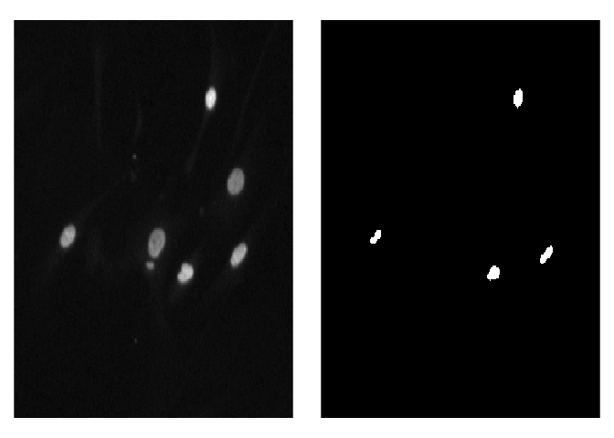
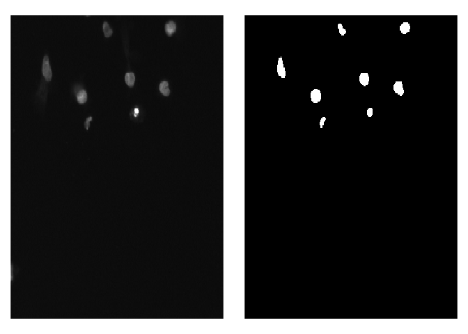

Today we will work on [2018 Data Science
Bowl](https://www.kaggle.com/c/data-science-bowl-2018/data) dataset. You
can download images and masks directly form the url or using `Kagge API`
:

`kaggle competitions download -c data-science-bowl-2018`

After downloading the data, unpack them and move to preferred
destination. For this example we will be interested only in
`stage1_train` and `stage1_test` subdirectories, so you can delete other
files if you want.

Before we start, let’s investigate a little bit.

``` r
library(tidyverse)
library(platypus)
library(abind)
library(here)

# Print current working directory
here()
```

    ## [1] "/home/maju116/Desktop/PROJECTS/Moje Projekty/platypus"

``` r
# Set directories with the data and models
data_path <- here("examples/data/data-science-bowl-2018/")
models_path <- here("examples/models/")

# Investigate one instance of data (image + masks)
sample_image_path <- here("examples/data/data-science-bowl-2018/stage1_train/00071198d059ba7f5914a526d124d28e6d010c92466da21d4a04cd5413362552/")

list.files(sample_image_path, full.names = TRUE) %>%
  set_names(basename(.)) %>%
  map(~ list.files(.))
```

    ## $images
    ## [1] "00071198d059ba7f5914a526d124d28e6d010c92466da21d4a04cd5413362552.png"
    ## 
    ## $masks
    ##  [1] "07a9bf1d7594af2763c86e93f05d22c4d5181353c6d3ab30a345b908ffe5aadc.png"
    ##  [2] "0e548d0af63ab451616f082eb56bde13eb71f73dfda92a03fbe88ad42ebb4881.png"
    ##  [3] "0ea1f9e30124e4aef1407af239ff42fd6f5753c09b4c5cac5d08023c328d7f05.png"
    ##  [4] "0f5a3252d05ecdf453bdd5e6ad5322c454d8ec2d13ef0f0bf45a6f6db45b5639.png"
    ##  [5] "2c47735510ef91a11fde42b317829cee5fc04d05a797b90008803d7151951d58.png"
    ##  [6] "4afa39f2a05f9884a5ff030d678c6142379f99a5baaf4f1ba7835a639cb50751.png"
    ##  [7] "4bc58dbdefb2777392361d8b2d686b1cc14ca310e009b79763af46e853e6c6ac.png"
    ##  [8] "4e3b49fb14877b63704881a923365b68c1def111c58f23c66daa49fef4b632bf.png"
    ##  [9] "5522143fa8723b66b1e0b25331047e6ae6eeec664f7c8abeba687e0de0f9060a.png"
    ## [10] "58656859fb9c13741eda9bc753c3415b78d1135ee852a194944dee88ab70acf4.png"
    ## [11] "6442251746caac8fc255e6a22b41282ffcfabebadbd240ee0b604808ff9e3383.png"
    ## [12] "7ff04129f8b6d9aaf47e062eadce8b3fcff8b4a29ec5ad92bca926ac2b7263d2.png"
    ## [13] "8bbec3052bcec900455e8c7728d03facb46c880334bcc4fb0d1d066dd6c7c5d2.png"
    ## [14] "9576fe25f4a510f12eecbabfa2e0237b98d8c2622b9e13b9a960e2afe6da844e.png"
    ## [15] "95deddb72b845b1a1f81a282c86e666045da98344eaa2763d67e2ab80bc2e5c3.png"
    ## [16] "a1b0cdb21f341af17d86f23596df4f02a6b9c4e0d59a7f74aaf28b9e408a4e4c.png"
    ## [17] "aa154c70e0d82669e9e492309bd00536d2b0f6eeec1210014bbafbfc554b377c.png"
    ## [18] "acba6646e8250aab8865cd652dfaa7c56f643267ea2e774aee97dc2342d879d6.png"
    ## [19] "ae00049dc36a1e5ffafcdeadb44b18a9cd6dfd459ee302ab041337529bd41cf2.png"
    ## [20] "af4d6ff17fa7b41de146402e12b3bab1f1fe3c1e6f37da81a54e002168b1e7dd.png"
    ## [21] "b0cbc2c553f9c4ac2191395236f776143fb3a28fb77b81d3d258a2f45361ca89.png"
    ## [22] "b6fc3b5403de8f393ca368553566eaf03d5c07148539bc6141a486f1d185f677.png"
    ## [23] "be98de8a7ba7d5d733b1212ae957f37b5b69d0bf350b9a5a25ba4346c29e49f7.png"
    ## [24] "cb53899ef711bce04b209829c61958abdb50aa759f3f896eb7ed868021c22fb4.png"
    ## [25] "d5024b272cb39f9ef2753e2f31344f42dd17c0e2311c4927946bc5008d295d2e.png"
    ## [26] "f6eee5c69f54807923de1ceb1097fc3aa902a6b20d846f111e806988a4269ed0.png"
    ## [27] "ffae764df84788e8047c0942f55676c9663209f65da943814c6b3aca78d8e7f7.png"

As you can see each image has its own directory, that has two
subdirectories inside: - **images** - contains original image that will
be the input of the neural network - **masks** - contains **one or
more** segmentation masks. **Segmentation mask** is simply telling us
which pixel belongs to which class, and this is what we will try to
predict.

For the modeling, beside **train** and **test** sets, we will also need
a **validation** set (No one is forcing you, but it’s a good practice!):

``` r
train_path <- here("examples/data/data-science-bowl-2018/stage1_train/")
test_path <- here("examples/data/data-science-bowl-2018/stage1_test/")
validation_path <- here("examples/data/data-science-bowl-2018/stage1_validation/")

if (!dir.exists(validation_path)) {
  dir.create(validation_path)
  # List train images
  train_samples <- list.files(train_path, full.names = TRUE)
  set.seed(1234)
  # Select 10% for validation
  validation_samples <- sample(train_samples, round(0.1 * length(train_samples)))
  validation_samples %>%
    walk(~ system(paste0('mv "', ., '" "', validation_path, '"')))
}
```

Since we now something about our data, we can now move to the modeling
part. We will start by selecting the architecture of the neural network.
In case of semantic segmentation there is a few different choices like
**U-Net**, **Fast-FCN**, **DeepLab** and many more. For the time being
in the [platypus](https://github.com/maju116/platypus) package you have
access only to the **U-Net** architecture.


**U-Net** was originally developed for biomedical data segmentation. As
you can see in the picture above architecture is very similar to
autoencoder and it looks like the letter **U**, hence the name. Model is
composed of 2 parts, and each part has some number of **convolutional
blocks** (3 in the image above). Number of blocks will be hyperparameter
in our model.

To build a **U-Net** model in `platypus` use `u_net` function. You have
to specify:

-   number of convolutional blocks,
-   input image height and width - must be in the form **2^N**!,
-   will input image be loaded as grayscale or RGB,
-   number of classes - in our case we have only 2 (background and
    nuclei)
-   additional arguments form CNN like number of filters, dropout rate

``` r
blocks <- 4 # Number of U-Net convolutional blocks
n_class <- 2 # Number of classes
net_h <- 256 # Must be in a form of 2^N
net_w <- 256 # Must be in a form of 2^N
grayscale <- FALSE # Will input image be in grayscale or RGB

DCB2018_u_net <- u_net(
  net_h = net_h,
  net_w = net_w,
  grayscale = grayscale,
  blocks = blocks,
  n_class = n_class,
  filters = 16,
  dropout = 0.1,
  batch_normalization = TRUE,
  kernel_initializer = "he_normal"
)
```

After that it’s time to select **loss** and additional metrics. Because
semantic segmentation is in essence classification for each pixel
instead of the whole image, you can use **categorical cross-entropy** as
a loss function and **accuracy** as a metric. Other common choice,
available in `platypus`, would be [**dice
coefficient/loss**](https://en.wikipedia.org/wiki/S%C3%B8rensen%E2%80%93Dice_coefficient).
You cna think of it as of a **F1-metric** for semantic segmentation.

``` r
DCB2018_u_net %>%
  compile(
    optimizer = optimizer_adam(lr = 1e-3),
    loss = loss_dice(),
    metrics = metric_dice_coeff()
  )
```

The next step will be data ingestion. As you remember we have a separate
directory and multiple masks for each image. That’s not a problem for
`platypus`! You can ingest data using `segmentation_generator` function.
The first argument to specify is the directory with all the images and
masks. To tell `platypus` that it has to load images and masks from
separate directories for each data sample specify argument
`mode = "nested_dirs"`. Additionally you can set images/masks
subdirectories names using `subdirs` argument. `platypus` will
automatically merge multiple masks for each image, but we have to tell
him how to recognize which pixel belongs to which class. In the
segmentation masks each class is recognized by a specific RGB value. In
our case we have only black (R = 0, G = 0, B = 0) pixel for background
and white (R = 255, G = 255, B = 255) pixels for nuclei. To tell
`platypus` how to recognize classes on segmentation masks use `colormap`
argument.

``` r
binary_colormap
```

    ## [[1]]
    ## [1] 0 0 0
    ## 
    ## [[2]]
    ## [1] 255 255 255

``` r
train_DCB2018_generator <- segmentation_generator(
  path = train_path, # directory with images and masks
  mode = "nested_dirs", # Each image with masks in separate folder
  colormap = binary_colormap,
  only_images = FALSE,
  net_h = net_h,
  net_w = net_w,
  grayscale = FALSE,
  scale = 1 / 255,
  batch_size = 32,
  shuffle = TRUE,
  subdirs = c("images", "masks") # Names of subdirs with images and masks
)
```

    ## 603 images with corresponding masks detected!
    ## Set 'steps_per_epoch' to: 19

``` r
validation_DCB2018_generator <- segmentation_generator(
  path = validation_path, # directory with images and masks
  mode = "nested_dirs", # Each image with masks in separate folder
  colormap = binary_colormap,
  only_images = FALSE,
  net_h = net_h,
  net_w = net_w,
  grayscale = FALSE,
  scale = 1 / 255,
  batch_size = 32,
  shuffle = TRUE,
  subdirs = c("images", "masks") # Names of subdirs with images and masks
)
```

    ## 67 images with corresponding masks detected!
    ## Set 'steps_per_epoch' to: 3

We can now fit the model.

``` r
history <- DCB2018_u_net %>%
  fit_generator(
    train_DCB2018_generator,
    epochs = 20,
    steps_per_epoch = 19,
    validation_data = validation_DCB2018_generator,
    validation_steps = 3,
    callbacks = list(callback_model_checkpoint(
      filepath = file.path(models_path, "DSB2018_w.hdf5"),
      save_best_only = TRUE,
      save_weights_only = TRUE,
      monitor = "dice_coeff",
      mode = "max",
      verbose = 1)
    )
  )
```

And calculate predictions for the new images. Our model will return a
4-dimensional array (number of images, height, width, number of classes)
- each pixel will have N probabilities, where N is number of classes. to
transform raw predictions into segmentation map (by selecting class with
max probability for each pixel) you can use `get_masks` function.

``` r
test_DCB2018_generator <- segmentation_generator(
  path = test_path,
  mode = "nested_dirs",
  colormap = binary_colormap,
  only_images = TRUE,
  net_h = net_h,
  net_w = net_w,
  grayscale = FALSE,
  scale = 1 / 255,
  batch_size = 32,
  shuffle = FALSE,
  subdirs = c("images", "masks")
)
```

    ## 65 images detected!
    ## Set 'steps_per_epoch' to: 3

``` r
test_preds <- predict_generator(DCB2018_u_net, test_DCB2018_generator, 3)
dim(test_preds)
```

    ## [1]  65 256 256   2

``` r
test_masks <- get_masks(test_preds, binary_colormap)
dim(test_masks[[1]])
```

    ## [1] 256 256   3

To visualize predicted masks with the orginal images you can use
`plot_masks` function.

``` r
test_imgs_paths <- create_images_masks_paths(test_path, "nested_dirs", FALSE, c("images", "masks"), ";")$images_paths

plot_masks(
  images_paths = test_imgs_paths[1:4],
  masks = test_masks[1:4],
  labels = c("background", "nuclei"),
  colormap = binary_colormap
)
```


