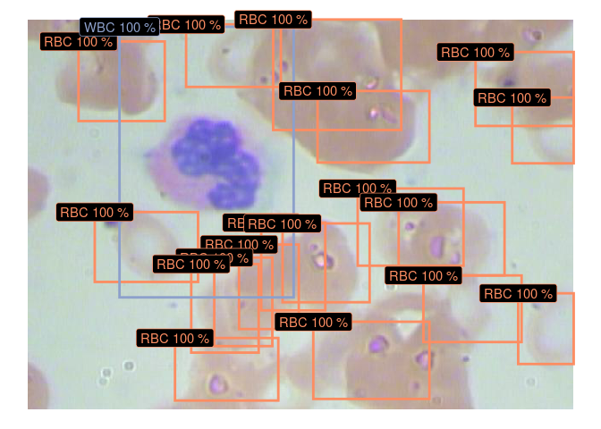
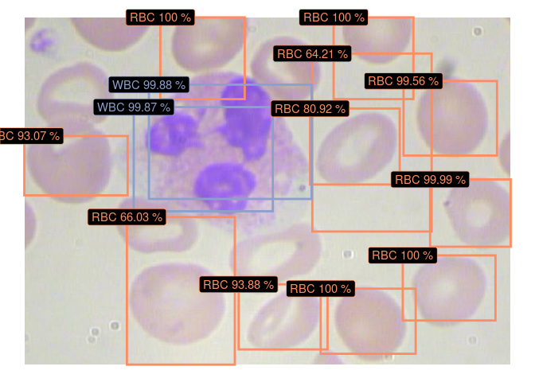
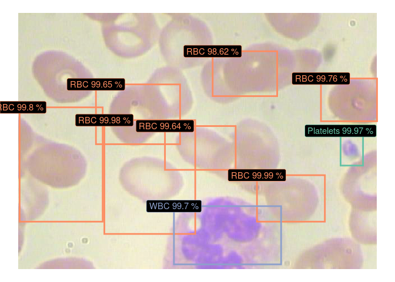

Download images and annotations: [BCCD
dataset](https://www.kaggle.com/surajiiitm/bccd-dataset?).

Split dataset into train, validation and test set

``` r
library(tidyverse)
library(platypus)
library(abind)
library(here)

BCCD_path <- here("development/BCCD/")
annot_path <- file.path(BCCD_path, "Annotations/")
images_path <- file.path(BCCD_path, "JPEGImages/")

c("train", "valid", "test") %>%
  walk(~ {
    dir.create(file.path(BCCD_path, .))
    dir.create(file.path(BCCD_path, ., "Annotations/"))
    dir.create(file.path(BCCD_path, ., "JPEGImages/"))
  })

annot_paths <- list.files(annot_path, full.names = TRUE)
images_paths <- list.files(images_path, full.names = TRUE)
n_samples <- length(annot_paths)
set.seed(111)
train_ids <- sample(1:n_samples, round(0.8 * n_samples))
valid_ids <- sample(setdiff(1:n_samples, train_ids), round(0.19 * n_samples))
test_ids <- setdiff(1:n_samples, c(train_ids, valid_ids))

walk2(c("train", "valid", "test"), list(train_ids, valid_ids, test_ids), ~ {
  annots <- annot_paths[.y]
  images <- images_paths[.y]
  dir_name <- .x
  annots %>% walk(~ file.copy(., gsub("BCCD", paste0("BCCD/", dir_name), .)))
  images %>% walk(~ file.copy(., gsub("BCCD", paste0("BCCD/", dir_name), .)))
})
```

Generate custom anchor boxes:

``` r
blood_labels <- c("Platelets", "RBC", "WBC")
n_class <- length(blood_labels)
net_h <- 416 # Must be divisible by 32
net_w <- 416 # Must be divisible by 32
anchors_per_grid <- 3

blood_anchors <- generate_anchors(
  anchors_per_grid = anchors_per_grid, # Number of anchors (per one grid) to generate
  annot_path = annot_path, # Annotations directory
  labels = blood_labels, # Class labels
  n_iter = 10, # Number of k-means++ iterations
  annot_format = "pascal_voc", # Annotations format
  seed = 55, # Random seed
  centroid_fun = mean # Centroid function
)
```

    ##       label    n
    ## 1 Platelets  361
    ## 2       RBC 4153
    ## 3       WBC  372


``` r
blood_anchors
```

    ## [[1]]
    ## [[1]][[1]]
    ## [1] 0.3552235 0.4417515
    ## 
    ## [[1]][[2]]
    ## [1] 0.2911290 0.3292675
    ## 
    ## [[1]][[3]]
    ## [1] 0.1971296 0.2346442
    ## 
    ## 
    ## [[2]]
    ## [[2]][[1]]
    ## [1] 0.1757463 0.1592062
    ## 
    ## [[2]][[2]]
    ## [1] 0.1652637 0.2065506
    ## 
    ## [[2]][[3]]
    ## [1] 0.1630269 0.2439239
    ## 
    ## 
    ## [[3]]
    ## [[3]][[1]]
    ## [1] 0.1391842 0.1769376
    ## 
    ## [[3]][[2]]
    ## [1] 0.1245985 0.2258089
    ## 
    ## [[3]][[3]]
    ## [1] 0.06237392 0.08062560

Build `YOLOv3` model (you can load [YOLOv3
Darknet](https://pjreddie.com/darknet/yolo/) weights trained on [COCO
dataset](https://cocodataset.org/#home). Download pre-trained weights
from [here](https://pjreddie.com/media/files/yolov3.weights)):

``` r
blood_yolo <- yolo3(
  net_h = net_h, # Input image height
  net_w = net_w, # Input image width
  grayscale = FALSE, # Should images be loaded as grayscale or RGB
  n_class = n_class, # Number of object classes (80 for COCO dataset)
  anchors = blood_anchors # Anchor boxes
)
blood_yolo %>% load_darknet_weights(here("development/yolov3.weights")) # Optional

blood_yolo
```

    ## Model
    ## Model: "yolo3"
    ## ________________________________________________________________________________
    ## Layer (type)              Output Shape      Param #  Connected to               
    ## ================================================================================
    ## input_img (InputLayer)    [(None, 416, 416, 0                                   
    ## ________________________________________________________________________________
    ## darknet53 (Model)         multiple          40620640 input_img[0][0]            
    ## ________________________________________________________________________________
    ## yolo3_conv1 (Model)       (None, 13, 13, 51 11024384 darknet53[1][2]            
    ## ________________________________________________________________________________
    ## yolo3_conv2 (Model)       (None, 26, 26, 25 2957312  yolo3_conv1[1][0]          
    ##                                                      darknet53[1][1]            
    ## ________________________________________________________________________________
    ## yolo3_conv3 (Model)       (None, 52, 52, 12 741376   yolo3_conv2[1][0]          
    ##                                                      darknet53[1][0]            
    ## ________________________________________________________________________________
    ## grid1 (Model)             (None, 13, 13, 3, 4747288  yolo3_conv1[1][0]          
    ## ________________________________________________________________________________
    ## grid2 (Model)             (None, 26, 26, 3, 1194008  yolo3_conv2[1][0]          
    ## ________________________________________________________________________________
    ## grid3 (Model)             (None, 52, 52, 3, 302104   yolo3_conv3[1][0]          
    ## ================================================================================
    ## Total params: 61,587,112
    ## Trainable params: 61,534,504
    ## Non-trainable params: 52,608
    ## ________________________________________________________________________________

Compile the model with correct loss and metrics:

``` r
blood_yolo %>% compile(
  optimizer = optimizer_adam(lr = 1e-5),
  loss = yolo3_loss(blood_anchors, n_class = n_class),
  metrics = yolo3_metrics(blood_anchors, n_class = n_class)
)
```

Create data generators:

``` r
train_blood_yolo_generator <- yolo3_generator(
  annot_path = file.path(BCCD_path, "train", "Annotations/"),
  images_path = file.path(BCCD_path, "train", "JPEGImages/"),
  net_h = net_h,
  net_w = net_w,
  batch_size = 16,
  shuffle = FALSE,
  labels = blood_labels
)
```

    ## 291 images with corresponding annotations detected!
    ## Set 'steps_per_epoch' to: 19

``` r
valid_blood_yolo_generator <- yolo3_generator(
  annot_path = file.path(BCCD_path, "valid", "Annotations/"),
  images_path = file.path(BCCD_path, "valid", "JPEGImages/"),
  net_h = net_h,
  net_w = net_w,
  batch_size = 16,
  shuffle = FALSE,
  labels = blood_labels
)
```

    ## 69 images with corresponding annotations detected!
    ## Set 'steps_per_epoch' to: 5

Fit the model:

``` r
blood_yolo %>%
  fit_generator(
    generator = blood_yolo_generator,
    epochs = 1000,
    steps_per_epoch = 19,
    validation_data = valid_blood_yolo_generator,
    validation_steps = 5,
    callbacks = list(callback_model_checkpoint("development/BCCD/blood_w.hdf5",
                                               save_best_only = TRUE,
                                               save_weights_only = TRUE)
    )
  )
```

Predict on new images:

``` r
blood_yolo <- yolo3(
  net_h = net_h,
  net_w = net_w,
  grayscale = FALSE,
  n_class = n_class,
  anchors = blood_anchors
)
blood_yolo %>% load_model_weights_hdf5(here("development/BCCD/blood_w.hdf5"))

test_blood_yolo_generator <- yolo3_generator(
  annot_path = file.path(BCCD_path, "test", "Annotations/"),
  images_path = file.path(BCCD_path, "test", "JPEGImages/"),
  net_h = net_h,
  net_w = net_w,
  batch_size = 4,
  shuffle = FALSE,
  labels = blood_labels
)
```

    ## 4 images with corresponding annotations detected!
    ## Set 'steps_per_epoch' to: 1

``` r
test_preds <- predict_generator(blood_yolo, test_blood_yolo_generator, 1)

test_boxes <- get_boxes(test_preds, blood_anchors, blood_labels,
                        obj_threshold = 0.6)

plot_boxes(images_paths = list.files(file.path(BCCD_path, "test", "JPEGImages/"), full.names = TRUE),
           boxes = test_boxes,
           labels = blood_labels,
           save_dir = BCCD_path)
```


