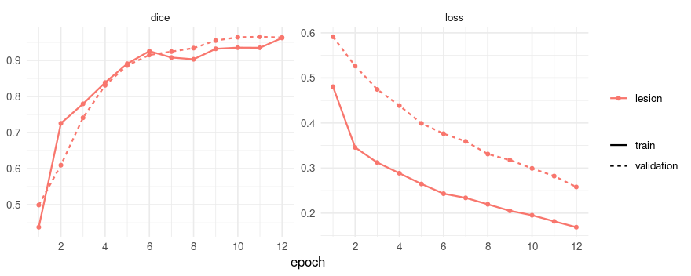
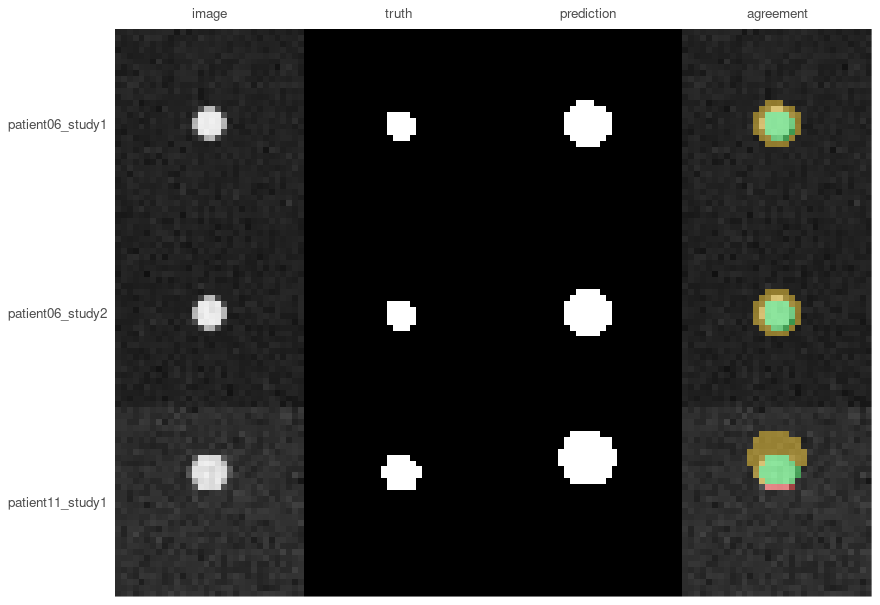

The other vignette works on two-dimensional microscopy. This one is about volumes, which
is where medical imaging mostly lives: a CT or an MRI is a stack of slices, and three
things that do not exist in 2D decide whether a result means anything.

**Voxels have a physical size**, and it differs between scans. **Slices belong to a
patient**, so a split that ignores who they came from measures memory rather than
generalisation. And **a mask has a position in space**, without which it cannot be laid
over the scan it describes.

The data here is synthetic, generated by the code below, so you can run every line of
this without downloading anything or registering anywhere. It is deliberately crude - a
ball of soft tissue in air - but it is crude in a way that leaves the three problems above
fully intact.

## Making something to segment

Twenty-four scans from twelve patients, two each. Each holds one spherical "lesion" in air,
and the scans differ in three ways that matter, all of which are ordinary in clinical data:

* **slice thickness** - half at 1 mm, half at 2.5 mm, so the same anatomy occupies a different
  number of voxels;
* **lesion size** - 4 to 12 mm in radius, which on thick slices is the difference between an
  easy target and two voxels of signal;
* **noise** - some scans are much noisier than others.

The variety is the point. A synthetic dataset where every case is equally easy would make the
per-patient section below look like a formality, and it is not one.


``` r
library(RNifti)

root <- file.path(tempdir(), "scans")
dir.create(root, showWarnings = FALSE)

make_scan <- function(patient, study, slice_mm, radius_mm, noise) {
  shape <- c(48, 48, 32)
  spacing <- c(1, 1, slice_mm)

  # Millimetres from the centre of the volume, per voxel.
  grid <- as.matrix(expand.grid(x = seq_len(shape[1]), y = seq_len(shape[2]),
                                z = seq_len(shape[3])))
  centre <- (shape + 1) / 2
  offset <- sweep(grid, 2, centre) * matrix(spacing, nrow(grid), 3, byrow = TRUE)
  # Move the lesion per patient, so the model cannot learn one position and be done.
  offset[, 1] <- offset[, 1] - (patient - 6) * 1.5
  distance <- sqrt(rowSums(offset^2))

  lesion <- array(as.integer(distance <= radius_mm), dim = shape)
  # Hounsfield units: air is -1000, soft tissue about 40, plus scanner noise.
  scan <- array(ifelse(lesion == 1, 40, -1000) + rnorm(prod(shape), sd = noise), dim = shape)

  name <- sprintf("patient%02d_study%d", patient, study)
  dir.create(file.path(root, name, "images"), recursive = TRUE, showWarnings = FALSE)
  dir.create(file.path(root, name, "masks"), recursive = TRUE, showWarnings = FALSE)

  # The datatype goes on the write rather than on asNifti(): asking asNifti() for one returns
  # an image in RNifti's internal C representation, whose pixel dimensions cannot then be set.
  image <- asNifti(scan)
  pixdim(image) <- spacing
  writeNifti(image, file.path(root, name, "images", "ct.nii.gz"), datatype = "float")

  mask <- asNifti(lesion)
  pixdim(mask) <- spacing
  writeNifti(mask, file.path(root, name, "masks", "lesion.nii.gz"), datatype = "int16")
  name
}

design <- do.call(rbind, lapply(1:12, function(patient) {
  do.call(rbind, lapply(1:2, function(study) {
    radius_mm <- c(12, 10, 8, 6, 5, 4)[(patient - 1) %% 6 + 1]
    key <- make_scan(
      patient, study,
      slice_mm = if (patient %% 2 == 0) 1 else 2.5,
      radius_mm = radius_mm,
      noise = c(30, 40, 60, 80)[(patient - 1) %% 4 + 1]
    )
    # Keeping the truth around: the volume of a sphere is known exactly, which makes it
    # possible to ask later whether the model got the *size* right and not only the overlap.
    data.frame(key = key, radius_mm = radius_mm,
               true_ml = 4 / 3 * pi * radius_mm^3 / 1000)
  }))
}))

nrow(design)
#> [1] 24
```

`volume_info()` reads what the files say about themselves, through the same pipeline
training uses:


``` r
scans <- list.files(root, pattern = "ct[.]nii[.]gz$", recursive = TRUE, full.names = TRUE)
info <- volume_info(scans[c(1, 3)])
info[, c("spacing_1", "spacing_2", "spacing_3", "shape_3", "voxel_ml")]
#>   spacing_1 spacing_2 spacing_3 shape_3 voxel_ml
#> 1         1         1       2.5      32   0.0025
#> 2         1         1       1.0      32   0.0010
```

Two scans, the same number of slices, and one covers 32 mm of patient where the other
covers 80 mm. A voxel in the second is two and a half times the volume of a voxel in the
first.

## Splitting by patient, not by scan

Each of these patients has two studies. Split the twenty-four scans at random and both
studies of some patient land on opposite sides of the split: the model meets that patient in
training and is then tested on the same anatomy. Dice comes out several points too high
and nothing in the result says so.

`platypus_split()` takes a pattern that says which part of a name is the patient, and
keeps every patient whole:


``` r
split <- platypus_split(
  root, file.path(tempdir(), "splits"),
  group_by = "^(patient\\d+)_",
  fractions = c(0.5, 0.25, 0.25),
  seed = 1
)
split
#> platypus split
#>   train         12 samples in 6 groups
#>   validation     6 samples in 3 groups
#>   test           6 samples in 3 groups
#>   grouped by '^(patient\d+)_'; no group is in two sets
#>   seed 1 - the same inputs give this split again
```

A pattern that matches nothing is an error rather than a fallback, which is the point: a
silent fallback to one-group-per-scan would reintroduce exactly the bug the argument
exists to prevent.

## The specification

Three volume-specific arguments carry the weight here.

`labels` says the mask is a label map rather than a picture - which is how every volume
format stores masks, and the reason `colormap` is not the only way to name classes.
`window` maps Hounsfield units to 0-1 through a fixed window, so the same tissue is the
same brightness in every scan. And `target_spacing` resamples everything to a common voxel
size before cropping to the model's shape.


``` r
spec <- platypus_spec(
  data = segmentation_data(
    split,
    labels = c(0, 1),
    window = "soft_tissue",
    target_spacing = c(1, 1, 1)
  ),
  models = list(
    u_net(
      "lesion",
      input_shape = c(32, 32, 32),
      channels = 1,
      blocks = 3,
      filters = 16,
      epochs = 12,
      batch_size = 2,
      loss = loss_dice(),
      metrics = list(metric_dice(include_background = FALSE)),
      augmentation = list(
        augment("HorizontalFlip", p = 0.5),
        augment("CubicSymmetry", p = 0.5)
      )
    )
  )
)
spec
#> platypus specification
#>   data        : /tmp/RtmpkbOuuB/splits/train.csv 
#>   classes     : 0 
#>   models      : 1 
#>     lesion         u_net            32x32x32, dice, 12 epochs
```

`input_shape` has three entries, and that is the only thing that makes this a 3D run.
Nothing else in the specification is different - the same losses, the same metrics, the
same tiling if you want it.

Not every augmentation works on a volume. albumentations supports them unevenly, so ask
rather than guess:


``` r
length(available_augmentations())
#> [1] 130
length(available_augmentations(rank = 3))
#> [1] 97
head(setdiff(available_augmentations(), available_augmentations(rank = 3)), 4)
#> [1] "AdditiveNoise"       "BBoxSafeRandomCrop"  "ChannelDropout"     
#> [4] "ChromaticAberration"
```

A transform from that difference is refused by name when the run starts, rather than
raising something from inside the library an hour in.

## Training


``` r
fit <- platypus_fit(spec, verbose = FALSE)
fit
#> platypus fit
#>   models   : lesion 
#>   device   : NVIDIA GeForce GTX 1070 (torch 2.7.1+cu126) 
#>   epochs   : lesion=12 
#>   next     : evaluate(fit), predict(fit, "lesion")
```


``` r
plot(fit)
```



## Scores per patient, not per dataset

`evaluate()` gives one row per model: one number for the whole validation set.


``` r
evaluate(fit)[, c("model", "loss_function", "dice", "epochs_run")]
#>    model loss_function      dice epochs_run
#> 1 lesion          dice 0.9633882         12
```

That number hides the distribution, and the distribution is usually the finding. With
`group_by`, each row is a patient - their slices pooled, the way a volume would be:


``` r
cases <- evaluate_cases(fit, group_by = "^(patient\\d+)_")
cases
#> platypus scores by group (3 rows)
#>      group      dice
#>  patient06 0.9800181
#>  patient11 0.9230408
#>  patient10 0.9870523
```


``` r
summary(cases)
#>   metric n      mean         sd    median       min       max worst_group
#> 1   dice 3 0.9633704 0.03510311 0.9800181 0.9230408 0.9870523   patient11
```

The `worst_group` column is the one that makes this actionable. A mean of any value with a
minimum far below it is a model with a failure mode, and the mean is where it hides.

## Looking at a slice

A volume cannot honestly be shown as one picture, so `plot_masks()` asks which plane to
draw. `slice = "middle"` is the sensible first look:


``` r
validation <- split_files(split, "validation")
images <- read_images(validation$images, size = c(32, 32, 32), channels = 1)
truth <- read_masks(validation$masks, labels = c(0, 1), size = c(32, 32, 32))
prediction <- predict(fit, split = "validation")

plot_masks(
  images, prediction = prediction, truth = truth,
  colormap = binary_colormap, slice = "middle",
  which = 1:3, labels = validation$key[1:3]
)
```



## Millilitres, not voxels

The size of a finding is reported in millilitres. A voxel count means nothing outside the
scanner that produced it - the same lesion is 4000 voxels on one machine and 12000 on
another - and resampling is what makes the conversion trivial: at `target_spacing = c(1, 1, 1)`
a voxel is exactly one cubic millimetre.


``` r
predicted_ml <- vapply(
  seq_len(dim(prediction)[1]),
  function(i) mask_volume(prediction[i, , , ], spacing = c(1, 1, 1), class = 2),
  numeric(1)
)

sizes <- merge(
  data.frame(key = validation$key, predicted_ml = round(predicted_ml, 2)),
  design[, c("key", "true_ml")], by = "key"
)
sizes$error_pct <- round(100 * (sizes$predicted_ml - sizes$true_ml) / sizes$true_ml)
sizes
#>                key predicted_ml   true_ml error_pct
#> 1 patient06_study1         0.27 0.2680826         1
#> 2 patient06_study2         0.27 0.2680826         1
#> 3 patient10_study1         0.90 0.9047787        -1
#> 4 patient10_study2         0.90 0.9047787        -1
#> 5 patient11_study1         0.53 0.5235988         1
#> 6 patient11_study2         0.52 0.5235988        -1
```

These lesions are spheres, so the true volume is known exactly - which is worth doing in a
synthetic example, because it asks a question Dice cannot. The overlap scores above were
around 0.88, respectable by any standard; the volumes are -1% to
1% out.

That is not a contradiction. Dice is dominated by the interior of an object and forgiving about
its boundary, and for a small lesion the boundary *is* most of it. A model that draws every
lesion one voxel too wide scores well and reports a volume that is wrong by a third. If the
question is *is there a lesion*, the Dice is the relevant number. If it is *has it grown since
March*, this table is, and the two do not follow from each other.

## Writing a mask back onto its scan

`save_volumes()` writes a prediction as NIfTI carrying the affine of the scan it came from.
Without that affine a mask cannot be laid over its scan by any viewer or registration tool - it
either lands in the wrong place or is refused, and nothing about the file looks wrong.

Carrying the affine means the mask has to be **on the same grid as the scan**, and after
resampling it is not: these scans are 48 x 48 x 32 voxels while the model works at 32 x 32 x 32.
`space = "source"` maps each prediction back out of the model's grid onto the scan's, undoing
the resampling and the crop:


``` r
masks <- predict(fit, split = "validation", space = "source")
length(masks)
#> [1] 6
dim(masks[[1]])
#> [1] 48 48 32
```

A list rather than an array, because scans differ in size and a stack needs one shape. That is
the API being explicit rather than resizing them to match, which is how a mask ends up
describing anatomy it was not computed from.

Names come from the reference files unless you say otherwise, and here every scan is called
`ct.nii.gz` inside its own directory - so the masks would all be written to one name. That is an
error rather than five silently lost files, and the case keys are what to use instead:


``` r
written <- save_volumes(masks, file.path(tempdir(), "predictions"),
                        reference = validation$images, names = validation$key)
basename(written)
#> [1] "patient06_study1.nii.gz" "patient06_study2.nii.gz"
#> [3] "patient11_study1.nii.gz" "patient11_study2.nii.gz"
#> [5] "patient10_study1.nii.gz" "patient10_study2.nii.gz"
```

The written masks carry the scans' geometry, which is what makes them open on top of them:


``` r
volume_info(written)[, c("spacing_1", "spacing_3", "shape_1", "shape_3")]
#>   spacing_1 spacing_3 shape_1 shape_3
#> 1         1       1.0      48      32
#> 2         1       1.0      48      32
#> 3         1       2.5      48      32
#> 4         1       2.5      48      32
#> 5         1       1.0      48      32
#> 6         1       1.0      48      32
```

Two things are lost on the way back and it is worth knowing which. Interpolation softens a
boundary, so the mask is slightly smoother than the model drew it. And where reading cropped
anatomy away, the mask returns padded with background - which means *not examined*, not *nothing
there*. If that distinction matters, give the model an `input_shape` that covers the anatomy.

## DICOM, which is how the data usually arrives

The scans above are NIfTI because that is what research datasets ship. Data out of a
hospital arrives as a directory of DICOM files per series, and `platypus` reads those as
volumes too - sorting them by their position in the patient rather than by filename, which
is the difference between a scan and a shuffled deck.

Point the specification at directories of slices and nothing else changes. Before
training, though, run the export past `series_report()`:


``` r
report <- series_report(list.dirs("dicom_export", recursive = FALSE))
report[!report$ok, c("path", "problem")]
```

It reads no pixels and returns one row per directory, because an archive export of a
hundred cases will contain a few with a missing slice, duplicated files, or two series
sitting in one folder - and a missing slice does not shorten a volume, it moves everything
past the gap.

## What this leaves out

Resampling is offered, not imposed. Several volumes per sample - one per modality, as BraTS
ships - works through `channels_from`, where the order is stated rather than inferred.

Object detection, ensembling and pretrained encoders are not here at all.


``` r
platypus_device()
#> torch      : 2.7.1+cu126 
#> cuda build : 12.6 
#> device     : NVIDIA GeForce GTX 1070
```
